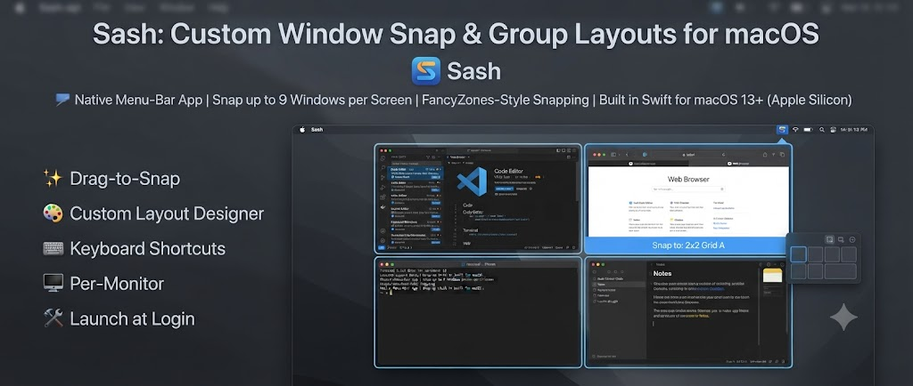

<p align="center">
  
</p>

# Sash

A native macOS menu-bar app for snapping and grouping windows into your own custom layouts —
up to 9 windows per screen in any arrangement. Drag a window and it snaps into a zone,
FancyZones-style. Built in Swift for Apple Silicon / macOS 13+.

> **sash** *(noun)* — "the framework in which panes of glass are set in a window or door."
> — [Merriam-Webster](https://www.merriam-webster.com/dictionary/sash)
>
> Fittingly, Sash is the framework that sets your windows' panes into place.

## Features

- **Drag-to-snap** — arm a layout, then drag any window; zones light up and it snaps into place.
- **Custom layout designer** — draw your own zones (any 1–9 window arrangement), name them, reuse them.
- **Keyboard shortcuts** — send the focused window to a zone with a hotkey.
- **Menu-bar picker** — pick a zone from the menu.
- **Per-monitor** — arm snapping on one display and leave your other monitors free.
- **Esc to cancel** a snap mid-drag.
- **Hold-⌃ mode** — optionally require holding Control to snap, so casual drags are untouched.
- **Launch at Login**, and a stable **app icon**.

## Drag-to-snap (the main way to place windows)

1. Menu bar ▸ **Drag windows into:** ▸ pick a layout (or **Off**).
2. Menu bar ▸ **Snap on monitor:** ▸ pick the display to snap on (or **Any**). Your other
   monitors stay free for manual arranging.
3. **Drag any window.** The zones appear as a translucent overlay; the one under the cursor
   highlights. **Release** to snap it in. Press **Esc** mid-drag to cancel.

Repeat for each window — drag them one by one into position.

## Custom layouts

Menu bar ▸ **Custom Setup…**

1. Pick the target monitor.
2. Design zones: set **Grid** (cols × rows) → **Generate Grid**, or **double-click** the canvas
   to add a zone, **drag** to move, drag the **corner** to resize. Select a zone to fine-tune
   X/Y/Width/Height or rename it; **Delete** removes it. Zones may overlap (e.g. two full-screen
   zones plus two centered — the "2 full + 2 center-half" arrangement).
3. Name it, then **Use for Drag-Snap** — it's armed immediately, start dragging windows in.
   (Or assign windows per-zone from the popups and hit **Apply** to place them all at once.)

Saved layouts appear in the menu and can be deleted there.

## Keyboard shortcuts

Modifier stack: **⌃⌥⌘** (Control-Option-Command)

| Shortcut | Action |
|---|---|
| ⌃⌥⌘ ← / → | Left / right half |
| ⌃⌥⌘ ↑ | Maximize |
| ⌃⌥⌘ 1–9 | Send focused window to zone 1–9 of the **armed** layout |

Snaps apply to the focused window (on the armed monitor, or the screen under the mouse).

## Build & run

```bash
./scripts/build_app.sh release   # builds, bundles, signs
open build/Sash.app
```

On first launch, grant **Accessibility** permission (System Settings ▸ Privacy & Security ▸
Accessibility) — the app can't move other apps' windows without it.

### Make the permission stick across rebuilds (optional, run once)

```bash
./scripts/make_cert.sh   # creates a stable self-signed code-signing identity
```

Without this, each rebuild is ad-hoc signed and macOS re-asks for Accessibility. With it,
`build_app.sh` signs with a stable identity so you grant permission just once.

## Package as a DMG

```bash
./scripts/make_dmg.sh release   # builds the app, then packages build/Sash.dmg
```

The disk image contains `Sash.app` and an `Applications` shortcut — open it and drag Sash
onto Applications to install.

### Installing from the DMG

Sash is signed ad-hoc (no paid Apple Developer ID), so on a machine that didn't build it,
Gatekeeper will warn the first time. To open it anyway:

- **Right-click** `Sash.app` ▸ **Open** ▸ **Open** (only needed once), or
- clear the download quarantine flag: `xattr -dr com.apple.quarantine /Applications/Sash.app`

For friction-free distribution you'd need an Apple Developer ID plus notarization.

## Tests & coverage

The pure logic (geometry, layouts, persistence) lives in the `SashKit` target and is
fully unit-tested:

```bash
swift run SashTests   # runs the suite (works with only Command Line Tools)
./scripts/coverage.sh       # line/region/function coverage for SashKit (100%)
```

The AppKit/Accessibility glue in the `Sash` executable is driven by the OS window server
and is verified manually rather than unit-tested.

## Architecture

| Target | What |
|---|---|
| `SashKit` | Pure, testable logic: `Zone`/`Layout` geometry, coordinate math, layout persistence. No AppKit runtime deps. |
| `Sash` | The menu-bar app: window engine (Accessibility API), drag-snap overlay, hotkeys, the Custom Setup window. |
| `SashTests` | Dependency-free test runner (runs via `swift run`). |

macOS exposes other apps' windows through the **Accessibility API** (`AXUIElement`). Sash
reads a window and sets its `kAXPosition` / `kAXSize`, translating between AppKit (bottom-left
origin) and Accessibility (top-left origin) coordinates. Window ↔ on-screen matching uses the
private-but-stable `_AXUIElementGetWindow`.

## License

MIT — see [LICENSE](LICENSE).
