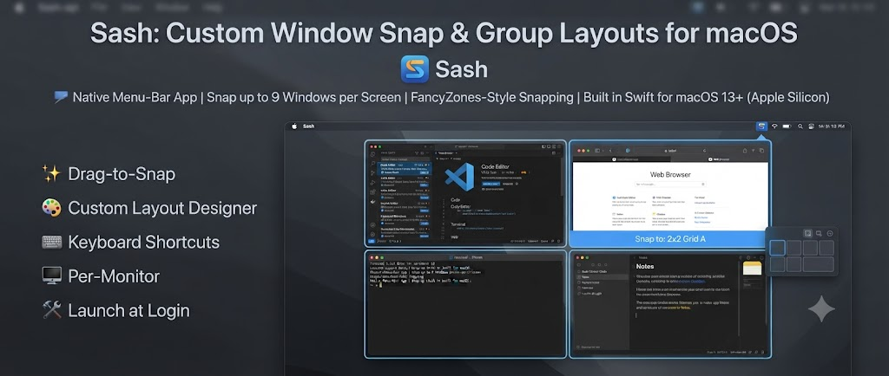

<p align="center">
  
</p>

# Sash

[](https://github.com/ismayc/sash/actions/workflows/ci.yml)
[](#tests--coverage)
[](LICENSE)


A native macOS menu-bar app for snapping and grouping windows into your own custom layouts —
up to 9 windows per screen in any arrangement. Drag a window and it snaps into a zone,
FancyZones-style. Built in Swift for Apple Silicon / macOS 13+.

> **sash** *(noun)* — "the framework in which panes of glass are set in a window or door."
> — [Merriam-Webster](https://www.merriam-webster.com/dictionary/sash)
>
> Fittingly, Sash is the framework that sets your windows' panes into place.

## Prior art & a shoutout to MacsyZones

Sash covers the same ground as **[MacsyZones](https://macsyzones.com/)** by
**[Meowing Cat (rohanrhu)](https://github.com/rohanrhu/MacsyZones)** — a mature, open-source
macOS zone-snapping app. I built Sash without realizing MacsyZones already existed, and it's
the much more developed version: it's been polished over many releases and has extras like
Shake-to-Snap and Quick Snapper. If you want a battle-tested tool today, go grab it:

```bash
brew install --cask macsyzones
```

Sash remains a smaller, from-scratch take that I maintain for my own workflow. Big thanks to
Meowing Cat for the excellent prior art. 🐈

One place Sash now goes beyond it: **[auto-arrange](#auto-arrange-let-sash-decide)** — a
single toggle that keeps a whole screen tiled as windows open and close. As of MacsyZones
v3.0.4 (May 2026), snapping there is per-window and user-initiated (drag-to-snap, Layout
Switcher, Quick Snapper); nothing keeps a screen continuously tiled on its own.

## Features

- **Drag-to-snap** — arm a layout, then drag any window; zones light up and it snaps into place.
- **Custom layout designer** — draw your own zones (any 1–9 window arrangement), name them, reuse them.
- **Keyboard shortcuts** — send the focused window to a zone with a hotkey.
- **Menu-bar picker** — pick a zone from the menu.
- **Auto-arrange** — on any monitors you like: one, two of three, or **all of them**. Sash works
  out the best tiling for whatever windows are on each and keeps it that way as windows open and
  close. The feature that sets Sash apart from other zone snappers. Three- and four-window
  arrangements get a standing choice, so you can pin your own split or plain thirds/quarters.
- **Keep space clear** — reserve a strip of a screen by dragging its edge in, and no tile will
  ever cover it. For desktop widgets, a wallpaper clock, anything that doesn't reserve its own
  space the way the Dock does.
- **Per-monitor** — arm snapping on one display and leave your other monitors free. Displays
  are picked up as you plug them in, and a monitor you've switched something on for is
  remembered while it's asleep or unplugged.
- **Esc to cancel** a snap mid-drag.
- **Hold-⇧ mode** — optionally require holding Shift to snap, so casual drags are untouched.
- **Launch at Login**, and a stable **app icon**.

## Drag-to-snap (the main way to place windows)

1. Menu bar ▸ **Drag windows into:** ▸ pick a layout (or **Off**).
2. Menu bar ▸ **Snap on monitor:** ▸ pick the display to snap on (or **Any**). Your other
   monitors stay free for manual arranging.
3. **Drag any window.** The zones appear as a translucent overlay; the one under the cursor
   highlights. **Release** to snap it in. Press **Esc** mid-drag to cancel.

Repeat for each window — drag them one by one into position.

## Monitors

Both monitor pickers — **Snap on monitor:** and **Auto-arrange windows on:** — list every
attached display, and the list is rebuilt each time you open the menu. Plug a monitor in, wake
it, or change its resolution and it's there; no restart.

If a display still isn't listed, **Refresh monitors** at the bottom of either picker forces a
re-scan.

A monitor you've switched something on for is **remembered while it's away**. Unplug it, or let
it sleep, and auto-arrange pauses rather than switching itself off — the menu reads
`LG ULTRAWIDE — waiting, not connected` — then resumes on its own when the display is back.
Your choice survives the cable, in other words; only unticking it clears it. The menu says which
ones it's still waiting for — `LG ULTRAWIDE + Studio Display — waiting, not connected` — and
with several monitors ticked the ones still plugged in carry on being tiled meanwhile.

## Keeping space clear (widgets, clocks, anything on the desktop)

Menu bar ▸ **Keep space clear:** ▸ pick a monitor. That screen dims to show the area Sash is
allowed to use; **drag any edge of it inwards** until whatever you're protecting is outside,
then press **⏎** (or **Save**). **Esc** cancels, **⌫** hands the whole screen back.

The strip you reserve stays see-through while you drag, because the whole point is to aim at
something on your desktop — you clear the widget by looking at it, not by guessing a number.
The pixel count shows beside the edge as you go.

From then on that strip is off limits to everything Sash does on that screen: drag-to-snap,
the hotkeys, the menu-bar zone picker and auto-arrange all size their tiles to what's left.
The Dock and the menu bar were already excluded — this is for the things that don't reserve
their own space.

Reserved space is remembered **per monitor, by name**, so it survives unplugging, sleep, a KVM
switch and a restart. A screen can't be reserved down to nothing: at most 80% of its width or
height can be taken, and dragging further just stops.

**Use the whole of every screen**, at the bottom of the same menu, clears the lot.

## Auto-arrange (let Sash decide)

Menu bar ▸ **Auto-arrange windows on:** ▸ **tick the monitors you want** — any combination, two
of three included. **All monitors** and **Off** sit above them, and **⌃⌥⌘A** ticks whichever
screen your mouse is on in or out.

Sash tiles every window on those screens immediately, then keeps them tiled: open a window and
it re-tiles to fit, close one and the rest expand to fill. Untick a monitor and its windows stay
exactly where they are.

Each screen is arranged on its own terms — its own window count, its own aspect ratio, its own
reserved space — and a screen whose windows haven't changed is left alone. Watching three
monitors costs no more polling than watching one, because the window list Sash checks each
second is system-wide either way.

**All monitors is not the same as ticking all of them.** Ticking means *those* monitors,
however many arrive later; **All monitors** means "and whatever I plug in next" — a new display
starts being kept tiled the moment it appears. Unticking one monitor while **All monitors** is
on names the rest explicitly, so "all" never quietly comes to mean "all but that one".

The shape comes from the window count *and* the screen's aspect ratio, so a wide screen splits
into columns where a laptop falls into a grid:

| Windows | 3440×1440 ultrawide | 1512×982 laptop |
|---|---|---|
| 2 | 2 columns | side by side |
| 3 | 3 columns | 2 on top, 1 across the bottom |
| 4 | 4 columns | 2×2 |
| 5 | 3 across, 2 across | 3 across, 2 across |

Where one of **your own** custom layouts has exactly as many zones as there are windows, Sash
uses that instead of the computed grid — so a layout you designed wins over a guess. (Layouts
with overlapping zones are skipped: overlaps are for cycling between windows by hand, not for
tiling.) The built-in layouts don't pre-empt the grid.

### Choosing the layout for 3 and 4 windows

Three and four windows are where taste actually differs — an asymmetric split you drew yourself
one day, plain thirds or quarters the next. So those two counts get a standing choice of their
own:

Menu bar ▸ **When 3 windows:** ▸ and **When 4 windows:** ▸ — each lists **Even grid** plus every
layout, built-in or custom, that has exactly that many non-overlapping zones. Pick one and Sash
re-tiles immediately; the pick sticks across restarts and applies only to that window count.

The tick sits on whatever is really in force, so before you pick anything it already shows what
auto-arrange would have done on its own. Naming a built-in here is the one way a built-in
pre-empts the grid. If you later delete or reshape the layout you picked, that count quietly
reverts to the automatic behaviour.

Two things it deliberately does **not** do: it won't undo a window you resize by hand (only
opening or closing a window re-tiles), and it won't move anything while a mouse button is
down, so it never fights a drag.

Some apps enforce a minimum window size and simply won't shrink to the tile they're given.
Sash notices and moves the shared edge instead: that window's tile grows to the size it
insists on and the tile beside it gives up the difference — capped at a quarter of itself, so
one stubborn window can't squash its neighbour flat. An uneven split that fits beats an even
one that overlaps.

## Custom layouts

Menu bar ▸ **Custom Setup…**

1. Pick the target monitor.
2. Design zones: set **Grid** (cols × rows) → **Generate Grid**, or **double-click** the canvas
   to add a zone, **drag** to move, drag the **corner** to resize. Select a zone to fine-tune
   X/Y/Width/Height or rename it; **Delete** removes it. Zones may overlap (e.g. two full-screen
   zones plus two centered — the "2 full + 2 center-half" arrangement).
3. Name it, then **Use for Drag-Snap** — it's armed immediately, start dragging windows in.
   (Or assign windows per-zone from the popups and hit **Apply** to place them all at once.)

Saved layouts appear in the menu and can be deleted there.

## Keyboard shortcuts

Modifier stack: **⌃⌥⌘** (Control-Option-Command)

| Shortcut | Action |
|---|---|
| ⌃⌥⌘ ← / → | Left / right half |
| ⌃⌥⌘ ↑ | Maximize |
| ⌃⌥⌘ 1–9 | Send focused window to zone 1–9 of the **armed** layout |
| ⌃⌥⌘ A | Toggle **auto-arrange** on the screen under the mouse |

Snaps apply to the focused window (on the armed monitor, or the screen under the mouse).

## Build & run

```bash
./scripts/build_app.sh release   # builds, bundles, signs
open build/Sash.app
```

On first launch, grant **Accessibility** permission (System Settings ▸ Privacy & Security ▸
Accessibility) — the app can't move other apps' windows without it.

### Make the permission stick across rebuilds (optional, run once)

```bash
./scripts/make_cert.sh   # creates a stable self-signed code-signing identity
```

Without this, each rebuild is ad-hoc signed and macOS re-asks for Accessibility. With it,
`build_app.sh` signs with a stable identity so you grant permission just once.

## Package as a DMG

```bash
./scripts/make_dmg.sh release   # builds the app, then packages build/Sash-<version>.dmg
```

The disk image contains `Sash.app` and an `Applications` shortcut — open it and drag Sash
onto Applications to install.

### Installing from the DMG

Sash is signed ad-hoc (no paid Apple Developer ID), so on a machine that didn't build it,
Gatekeeper will warn the first time. To open it anyway:

- **Right-click** `Sash.app` ▸ **Open** ▸ **Open** (only needed once), or
- clear the download quarantine flag: `xattr -dr com.apple.quarantine /Applications/Sash.app`

For friction-free distribution you'd need an Apple Developer ID plus notarization.

## Tests & coverage

The pure logic (geometry, layouts, persistence) lives in the `SashKit` target and is
fully unit-tested:

```bash
swift run SashTests   # runs the suite (works with only Command Line Tools)
./scripts/coverage.sh       # line/region/function coverage for SashKit (100%)
```

The AppKit/Accessibility glue in the `Sash` executable is driven by the OS window server
and is verified manually rather than unit-tested.

## Architecture

| Target | What |
|---|---|
| `SashKit` | Pure, testable logic: `Zone`/`Layout` geometry, coordinate math, auto-arrange tiling and scope, display targeting, reserved-space margins, layout persistence. No AppKit runtime deps. |
| `Sash` | The menu-bar app: window engine (Accessibility API), drag-snap overlay, auto-arrange watcher, hotkeys, the Custom Setup window, the reserved-space editor. |
| `SashTests` | Dependency-free test runner (runs via `swift run`). |

macOS exposes other apps' windows through the **Accessibility API** (`AXUIElement`). Sash
reads a window and sets its `kAXPosition` / `kAXSize`, translating between AppKit (bottom-left
origin) and Accessibility (top-left origin) coordinates. Window ↔ on-screen matching uses the
private-but-stable `_AXUIElementGetWindow`.

Every part of the app that decides how much of a screen it may use goes through one property,
`NSScreen.workArea` — the visible frame less whatever you've reserved on that display — so
snapping, the hotkeys, auto-arrange and the keep-on-screen clamp can't disagree about it.

## License

MIT — see [LICENSE](LICENSE).
